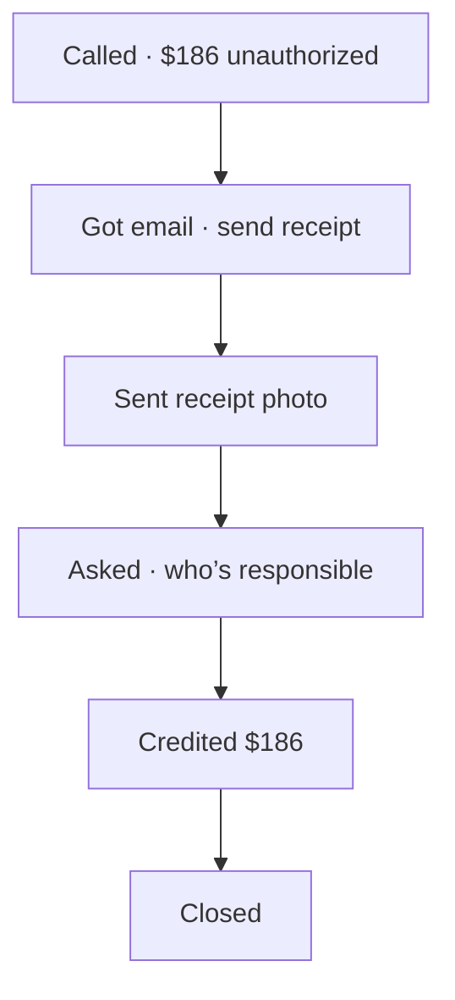
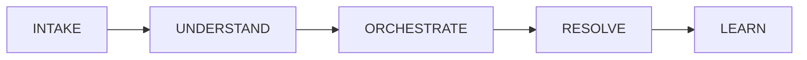

# Email Autopilot

Bank dispute workspace: write when it is safe, stop when a person must decide.

---

## 1. What it is

```
Not live          Weekly report         Bank-wide package
     │                  │                      │
     ▼                  ▼                      ▼
  Agent case       Supervisor             Admin canvas
```

| View | Who | Job |
|---|---|---|
| Agent | Priya N. | Handle one case |
| Supervisor | Elena Ruiz | See the week |
| Admin | Kenji Sato | Set what AI may do |

Keyboard: `1` Agent · `2` Supervisor · `3` Admin  
Demo: one HTML file, no backend.

---

## 2. Design rules

| # | Rule |
|---|---|
| 1 | One case, one thread |
| 2 | Voice context carries into email |
| 3 | No data → no claim |
| 4 | No money movement by AI |
| 5 | Liability / amount → human |
| 6 | Every outbound is auditable |

```
SAFE ROUTINE                 STOP
AUTO send                    DRAFT wait person
READ quote core only         BLOCK money / liability
```

---

## 3. People

```
Maya Chen          customer
Visa *4412         $186 unauthorized
       │
       ├── Voice  Sarah M.     intake
       ├── Email  Ava (AI)     write
       └── Gate   Priya N.     approve
```

| Role | Name | Sees |
|---|---|---|
| Customer | Maya Chen | Journey keywords only |
| AI | Ava (AI) | AUTO / READ / DRAFT |
| Agent | Priya N. | Human Gate · Approve & Send |
| Supervisor | Elena Ruiz | Weekly cards |
| Admin | Kenji Sato | Workflow graph |

---

## 4. Agent walkthrough

Maya’s Journey uses customer language. Internal Human Gate is hidden from her list.



```
┌ Pattern · 8 stages ─────────────────────────────────────┐
│ Received → Ask evidence → Got it → Confirmed            │
│ → Investigation → Status → Decision → Close             │
└─────────────────────────────────────────────────────────┘
┌ Maya Journey ┐ ┌ Activity Stream ┐ ┌ Detail ──────────┐
│ keywords     │ │ newest first    │ │ INTAKE → RESOLVE │
└──────────────┘ └─────────────────┘ └──────────────────┘
```

Human Gate (step 4):

```
Next Event       locked
Approve & Send   Priya only
Ava              stopped sending
```

---

## 5. Supervisor week

**Not live. Not daily. Closed week.**

| | Dates |
|---|---|
| This week | Mon 11 – Sun 17 Aug 2026 |
| Last week | Mon 4 – Sun 10 Aug |
| Arrow | this week vs last week |

```
STOCK at Sunday close              FLOW during the week
Open Cases 49                      Resolution Rate 92%
SLA Risk 7                         Repeat Contact 12%
Queue mix New/Inv/Wait = 49        AI Automation 89%
```

```
┌ KPI × 5 ──────────────────────────────────────────┐
│ Open · Resolution · Repeat · SLA Risk · Automation │
└────────────────────────────────────────────────────┘
┌ Queue Health          ┐  ┌ AI Performance         ┐
│ Donut = open mix      │  │ AUTO READ DRAFT BLOCK  │
│ Right = closed + risk │  │ Safety & outcome       │
└───────────────────────┘  └────────────────────────┘
```

Donut **is** 100% of open stock:

`New 18 + Investigation 22 + Waiting 9 = 49`

**Not** in the donut: Closed this week 124 · Aging · SLA · overdue  
Those are throughput or overlapping alerts.

---

## 6. Admin intent

Admin configures the **bank package**, not Maya’s ticket.  
Maya #4821 is only a **test fixture**.

| Fixture | Path | Result |
|---|---|---|
| Status follow-up | READ then AUTO | Resolved · no human |
| High-risk | BLOCK | Human review required |

---

## 7. Success picture

| Before | After |
|---|---|
| Customer repeats the story | Case context carries over |
| Template reply | Context-aware reply |
| Agent chases follow-up | AI follows up |
| No progress in writing | Status from core |
| Risk found late | Risk surfaced early |
| Humans do routine | Humans do exceptions |

---

## 8. Layers

```
┌─────────────────────────────────────────────┐
│  Agent workspace                             │
│  Supervisor weekly                           │
│  Admin workflow canvas                       │
├─────────────────────────────────────────────┤
│  Resolution Pattern · 8 stages               │
├─────────────────────────────────────────────┤
│  Engine  INTAKE → UNDERSTAND → ORCHESTRATE   │
│          → RESOLVE → LEARN                   │
├─────────────────────────────────────────────┤
│  Voice case · Email · Core card              │
└─────────────────────────────────────────────┘
```

---

## 9. Engine

Every activity shows four columns in Detail.



| Step | Does | Does not |
|---|---|---|
| INTAKE | Match person, channel, case | Send mail |
| UNDERSTAND | Intent, risk, missing docs | Send mail |
| ORCHESTRATE | Path, SLA, owner, gate | Invent status |
| RESOLVE | AUTO / READ / DRAFT / BLOCK | Move money |
| LEARN | Quality, re-contact | Customer copy |

Structured fields only (`key: value`). Lists go vertical. Risk / Permission / Path / Status / Quality are chips.

---

## 10. Pattern

Banking card dispute. Eight stages.

```
1 Problem Received      READ           Voice creates case
2 Evidence Requested    AUTO           Ack + receipt list
3 Evidence Received     AUTO           Match inbound to case
4 Evidence Confirmed    AUTO           Doc-nudge if blurry
5 Investigation         READ           Status from core only
6 Status Update         DRAFT + GATE   Liability language
7 Decision              READ + BLOCK   Amount from core
8 Close                 AUTO           Close after core resolved
```

---

## 11. Permission table

```
            send mail    quote core    invent     credit card
AUTO          yes          yes          no          no
READ          no           yes          no          no
DRAFT         no*          yes          no          no
BLOCK         no           yes          no          no
```

\* DRAFT writes a letter; a person must Approve & Send.

```
IF no core data     → no claim
IF money movement   → BLOCK
IF liability        → Human Gate
IF outbound         → audit log
```

---

## 12. Admin canvas

Left library · center graph · right inspect. Not editable in this demo.

```
Email Received
      ↓
Match Existing Case
      ↓
Identify Intent
      ↓
Check Case State
      ↓
Check Required Documents
      ├─ Missing → Request Documents   AUTO
      └─ Complete
            ↓
       Read Case Status                READ
            ↓
       Determine Action
       ├─ AUTO → Send Response
       ├─ READ → Return Status
       ├─ DRAFT → Human Review
       └─ BLOCK → Escalate
            ↓
       Update Case
            ↓
       Audit Log
```

Node shows: condition · mode · SLA · owner

Inspector: Rules · Knowledge · Connector · AI Permission · Human Approval · SLA · Audit

---

## 13. Test fixtures

Same package, two paths. Canvas: current node `run` → `done`; unused branches `skip`.

### A. #4821 status follow-up

```
✓ Email received
✓ Matched Case #4821
✓ Intent: Dispute Follow-up
✓ Documents: Receipt received
✓ Case Status: Investigation
→ READ: Retrieve authoritative status
→ AUTO: Send status update
✓ Case updated
✓ Audit logged

Result: Resolved / No Human Takeover Required
```

### B. #4821 high-risk

```
… same until Determine Action
→ BLOCK: amount / liability
→ Human Review Required

Result: BLOCK → Human Review Required
```

---

## 14. Case object

```
#4821
customer     Maya Chen · CUS-88421 · Visa *4412
dispute      $186.00 · River Market Grocery · posted Aug 16
voice        Sarah M. · 8m 42s · VOICE-SES-…
sla          confirm Sep 15 · investigate Nov 12
```

Sign-off: Ava (AI) on AUTO / READ close · Priya N. after Approve & Send · Meridian Trust Bank · Card Disputes

---

## 15. Agent UI map

```
Header     case · status tag · SLA tag · Priya N.
Pattern    8 dots
Actions    Next Event · Approve & Send · Escalate
Col 1      Maya’s Journey
Col 2      Activity Stream  newest first
Col 3      Trace + body
Drawer     AI Action Log  newest first
```

Stream badges: stage · Voice/Email · IN/OUT · AI / Agent / Customer  
No personal names on stream cards.

---

## 16. Data week

Reporting week is closed. Stock ≠ flow.

| Metric | Kind | Meaning |
|---|---|---|
| Open Cases 49 | stock | Sunday close |
| SLA Risk 7 | stock | Sunday close |
| Queue donut | stock | 49 open mix |
| Resolution 92% | flow | Mon–Sun |
| Repeat 12% | flow | Mon–Sun |
| AI 89% | flow | Actions this week |
| Closed 124 | flow | Closed Mon–Sun |
| Aging / SLA / overdue | alert ⊂ stock | Overlap allowed |

```
this week     11–17 Aug 2026
last week     4–10 Aug 2026
arrow         this vs last
```
