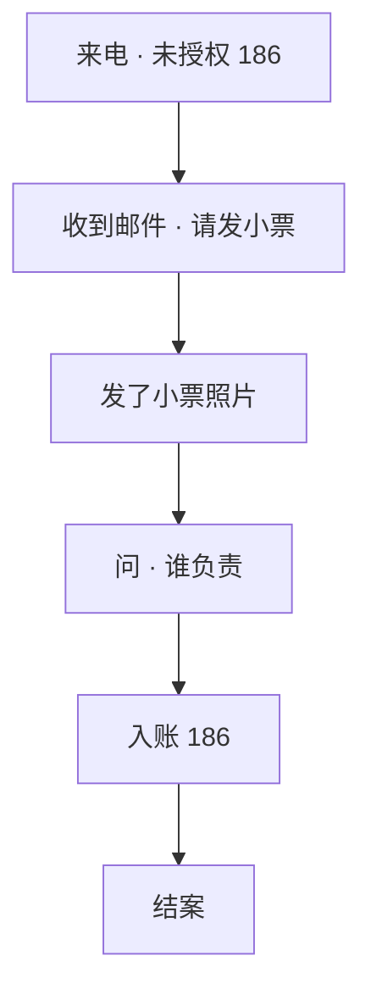
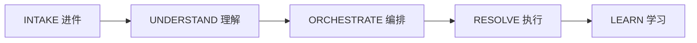

# 邮件智能处理助手

银行争议工作台：能安全写的就写，必须人决定的就停。

---

## 1. 是什么

```
非实时              周报                  全行规则包
     │               │                       │
     ▼               ▼                       ▼
  坐席办案         主管周报               管理员画布
```

| 视图 | 谁 | 做什么 |
|---|---|---|
| 坐席 | Priya N. | 处理一单 |
| 主管 | Elena Ruiz | 看这一周 |
| 管理员 | Kenji Sato | 规定 AI 能做什么 |

快捷键：`1` 坐席 · `2` 主管 · `3` 管理员  
演示：单文件 HTML，无后端。

---

## 2. 设计原则

| # | 规则 |
|---|---|
| 1 | 一案一线，不另开票 |
| 2 | 电话上下文带进邮件 |
| 3 | 没数据就不编状态 |
| 4 | AI 不挪钱 |
| 5 | 责任与金额必须过人 |
| 6 | 每封外发可审计 |

```
安全例行                     停下
AUTO 自动发                  DRAFT 草稿等人
READ 只读核心事实            BLOCK 拦截金额 / 责任
```

---

## 3. 角色

```
Maya Chen          客户
Visa *4412         未授权扣款 $186
       │
       ├── 语音  Sarah M.     进线开案
       ├── 邮件  Ava (AI)     写邮件
       └── 闸    Priya N.     批准发送
```

| 角色 | 名 | 看见 |
|---|---|---|
| 客户 | Maya Chen | 只看旅程关键词 |
| AI | Ava (AI) | AUTO / READ / DRAFT |
| 坐席 | Priya N. | 人工闸 · 批准发送 |
| 主管 | Elena Ruiz | 周报卡片 |
| 管理员 | Kenji Sato | 流程图 |

---

## 4. 坐席走查

Maya 旅程用客户说法。内部人工闸不出现在她的列表里。



```
┌ 模式 · 8 阶段 ──────────────────────────────────────┐
│ 问题进入 → 要证据 → 收到 → 确认                       │
│ → 调查 → 更新 → 决定 → 关闭                           │
└─────────────────────────────────────────────────────┘
┌ Maya 旅程   ┐ ┌ 活动流        ┐ ┌ Detail ──────────┐
│ 客户关键词   │ │ 新的在上       │ │ INTAKE → RESOLVE │
└─────────────┘ └──────────────┘ └──────────────────┘
```

人工闸（第 4 步）：

```
下一事件         锁定
批准发送         仅 Priya
Ava              停发
```

---

## 5. 主管周报

**非实时。非日报。已结束的一周。**

| | 日期 |
|---|---|
| 本周 | 2026-08-11 周一 – 08-17 周日 |
| 上周 | 2026-08-04 周一 – 08-10 周日 |
| 箭头 | 本周相对上周 |

```
周日收盘存量                      本周发生量
在办 49                           解决率 92%
SLA 风险 7                        重复联系 12%
队列构成 新/调查/等待 = 49         AI 自动化 89%
```

```
┌ KPI × 5 ──────────────────────────────────────────┐
│ 在办 · 解决率 · 重复联系 · SLA 风险 · 自动化        │
└────────────────────────────────────────────────────┘
┌ 队列健康              ┐  ┌ AI 表现                 ┐
│ 环图 = 在办构成        │  │ AUTO READ DRAFT BLOCK  │
│ 右 = 结案 + 预警       │  │ 安全与结果              │
└───────────────────────┘  └────────────────────────┘
```

环形图**就是**在办存量的 100%：

`新 18 + 调查 22 + 等待 9 = 49`

**不进环**：本周结案 124 · 超 5 天 · SLA · 跟进逾期  
那些是结案量或重叠预警。

---

## 6. 管理员意图

管理员配的是**全行争议包**，不是 Maya 这一单。  
Maya #4821 只是**试跑夹具**。

| 夹具 | 路径 | 结果 |
|---|---|---|
| 状态跟进 | 先 READ 再 AUTO | 结案 · 不转人 |
| 高风险 | BLOCK | 必须人审 |

---

## 7. 成功画面

| 前 | 后 |
|---|---|
| 客户重复讲述 | 案情接着用 |
| 模板回复 | 按案情回 |
| 坐席追跟进 | AI 跟进 |
| 书面看不到进度 | 状态来自核心 |
| 风险事后才发现 | 风险提前露出 |
| 人做例行 | 人做例外 |

---

## 8. 分层

```
┌─────────────────────────────────────────────┐
│  坐席工作台                                   │
│  主管周报                                     │
│  管理员流程画布                               │
├─────────────────────────────────────────────┤
│  解决模式 · 8 阶段                            │
├─────────────────────────────────────────────┤
│  引擎  INTAKE → UNDERSTAND → ORCHESTRATE     │
│        → RESOLVE → LEARN                     │
├─────────────────────────────────────────────┤
│  语音案件 · 邮件 · 核心卡片                    │
└─────────────────────────────────────────────┘
```

---

## 9. 引擎

每条活动在 Detail 里都是四列。



| 步 | 做 | 不做 |
|---|---|---|
| INTAKE | 匹配人、渠道、案件 | 发信 |
| UNDERSTAND | 意图、风险、缺件 | 发信 |
| ORCHESTRATE | 路径、时限、责任人、闸 | 编进度 |
| RESOLVE | AUTO / READ / DRAFT / BLOCK | 动钱 |
| LEARN | 质量、再联系 | 对客文案 |

只允许结构化字段（`key: value`）。多值纵向排列。风险 / 权限 / 路径 / 状态 / 质量用色条。

---

## 10. 模式

银行卡争议。八个阶段。

```
1 问题进入      READ           电话开案
2 索要证据      AUTO           确认 + 小票清单
3 收到证据      AUTO           入站挂到原案
4 证据确认      AUTO           模糊则催清晰件
5 调查          READ           状态只读核心
6 状态更新      DRAFT + 闸     责任表述
7 决定          READ + BLOCK   金额只读核心
8 关闭          AUTO           核心结案后关单
```

---

## 11. 权限表

```
            发信         引用核心       编造        给卡入账
AUTO         是           是            否          否
READ         否           是            否          否
DRAFT        否*          是            否          否
BLOCK        否           是            否          否
```

\* DRAFT 写信；必须有人批准发送。

```
若没有核心数据     → 不陈述
若资金移动         → BLOCK
若责任认定         → 人工闸
若外发             → 审计日志
```

---

## 12. 管理员画布

左元件库 · 中图画布 · 右检查器。本演示不可保存编辑。

```
邮件到达
      ↓
匹配已有案件
      ↓
识别意图
      ↓
检查案件状态
      ↓
检查必备材料
      ├─ 缺失 → 索要材料              AUTO
      └─ 齐全
            ↓
       读取案件状态                   READ
            ↓
       判定动作
       ├─ AUTO → 发送回复
       ├─ READ → 返回状态
       ├─ DRAFT → 人工审阅
       └─ BLOCK → 升级
            ↓
       更新案件
            ↓
       审计日志
```

节点上显示：条件 · 模式 · 时限 · 责任人

检查器：规则 · 知识 · 连接器 · AI 权限 · 人工批准 · 时限 · 审计

---

## 13. 试跑夹具

同一套包，两条路。画布：当前节点 `run` → `done`；未走分支 `skip`。

### A. #4821 状态跟进

```
✓ 邮件到达
✓ 匹配案件 #4821
✓ 意图：争议跟进
✓ 材料：已收到小票
✓ 案件状态：调查中
→ READ：读取权威状态
→ AUTO：发送状态更新
✓ 案件已更新
✓ 审计已记录

结果：已解决 / 不需要人接管
```

### B. #4821 高风险

```
… 直到判定动作相同
→ BLOCK：金额 / 责任
→ 必须人审

结果：拦截 → 必须人审
```

---

## 14. 案件对象

```
#4821
客户         Maya Chen · CUS-88421 · Visa *4412
争议         $186.00 · River Market Grocery · 入账 8月16日
语音         Sarah M. · 8分42秒 · VOICE-SES-…
时限         确认 9月15日 · 调查 11月12日
```

落款：AUTO / READ 关单用 Ava (AI) · 批准发送后用 Priya N. · Meridian Trust Bank · Card Disputes

---

## 15. 坐席界面

```
顶栏        案件 · 状态标签 · 时限标签 · Priya N.
模式        8 个点
操作        下一事件 · 批准发送 · 升级语音
列1         Maya 旅程
列2         活动流  新的在上
列3         轨迹 + 正文
抽屉        AI 动作日志  新的在上
```

流上的标记：阶段 · 语音/邮件 · 入/出 · AI / 坐席 / 客户  
卡片上不写人名。

---

## 16. 数据周

报告周已关账。存量 ≠ 发生量。

| 指标 | 类 | 含义 |
|---|---|---|
| 在办 49 | 存量 | 周日收盘 |
| SLA 风险 7 | 存量 | 周日收盘 |
| 队列环图 | 存量 | 49 在办构成 |
| 解决率 92% | 发生 | 周一至周日 |
| 重复联系 12% | 发生 | 周一至周日 |
| AI 89% | 发生 | 本周动作 |
| 结案 124 | 发生 | 本周结案 |
| 超期 / SLA / 逾期 | 预警 ⊂ 存量 | 允许重叠 |

```
本周     2026-08-11 – 08-17
上周     2026-08-04 – 08-10
箭头     本周对上周
```
